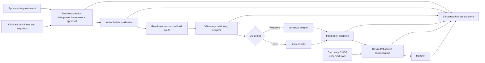
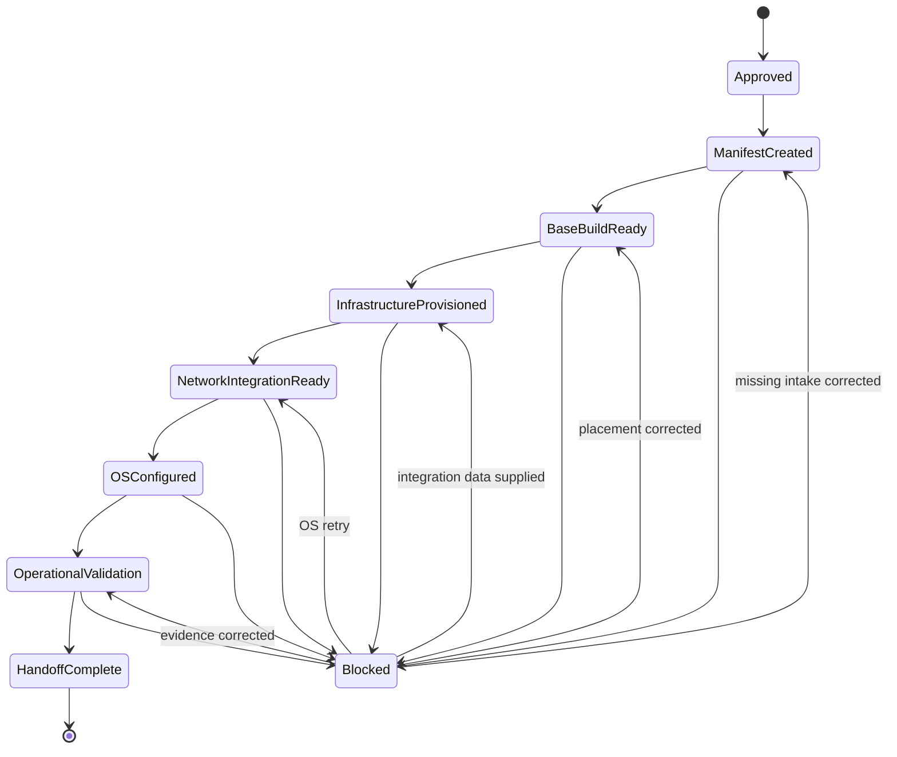
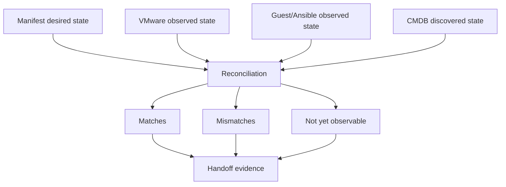

# Architecture

For stakeholder-focused diagrams of the lifecycle, responsibilities, lineage, platform reuse, and delivery pipeline, see [process-views.md](process-views.md).

## Architectural intent

The architecture is organized around a common server-build lifecycle. Windows and Linux are profiles of that lifecycle; VMware, Infoblox, object storage, and CMDB discovery are bounded integrations.

## State and artifact model



## System responsibilities

| Component | Owns | Does not own |
| --- | --- | --- |
| Request/approval system | request and approval decision | infrastructure execution details |
| Contract catalog | stable field, owner, mapping, gate, and interface definitions | per-build active state |
| Workflow/AAP coordination | current execution, retries, concurrency, and credentials | long-term artifact history by itself |
| Build manifest | approved intent, phase projection, provenance, blockers, and artifact references | secrets or discovered enterprise inventory |
| S3-compatible storage | versioned manifests, append-only events, evidence, final snapshots | transactional workflow locking or complex reporting |
| VMware | VM provisioning and virtualization-observed state | business approval or service ownership |
| OS adapters | Windows/Linux configuration outcomes | request and placement decisions |
| Infoblox and other adapters | integration-specific allocation and results | common lifecycle policy |
| CMDB discovery | discovered operational state | approved pre-build intent in the current environment |

## Lifecycle



The exact resume target is recorded in the manifest. The diagram shows permitted examples, not an instruction to infer state from the last successful task.

## Manifest creation boundary

The approved-request event must contain or reference enough evidence to prove that creation was authorized. The creation operation uses request ID plus approval reference as its idempotency key.

The initial write produces:

- manifest revision 1
- approval/request snapshot or immutable source reference
- selected contract version
- `manifest-created` lifecycle event
- object key, checksum, and version identifier when supported

If the same event is delivered again, the workflow must locate the existing logical manifest rather than create another server build.

## Common server model

Common fields include request, approval, application, hostname, OS family/version, compute, VMware template and placement, network profile, operational ownership, lifecycle status, provenance, and artifact references.

Platform profiles provide only genuine differences:

- supported OS versions and templates
- WinRM versus SSH connection behavior
- OS bootstrap and base configuration
- reboot and reconnect implementation
- platform-specific validation

## Desired and observed state



Not every desired field belongs in CMDB. The contract must identify which values should reconcile and which source is authoritative for each comparison.

## Object-storage boundary

Object storage keeps the history addressable without requiring shared-drive mounts. The recommended pattern is:

- a versioned current manifest
- append-only lifecycle events
- phase-specific immutable evidence where practical
- an immutable final handoff snapshot

Active coordination still needs one owner. Conditional writes, workflow locks, or another concurrency mechanism must prevent two jobs from advancing the same build simultaneously.

## Decision-rights model

| Decision | Where it belongs | Where it does not belong |
| --- | --- | --- |
| Approval and business purpose | request and approval source | role defaults |
| Supported Windows/Linux baseline | OS platform profile | request-specific task branch |
| VMware template and placement | versioned platform mappings | developer choice during a run |
| Inventory placement | deterministic mapping from approved facts | hand-authored request inventory |
| Network selection attributes | integration contract and mapping | hard-coded subnet |
| Runtime secrets | AAP credential boundary or secret store | manifest or object metadata |
| Exceptions | explicit approved override event | undocumented extra vars |

## Ansible content boundaries

- A thin lifecycle playbook sequences phases.
- Common roles implement manifest creation, readiness, normalization, evidence, and reconciliation.
- Windows and Linux roles implement a shared platform-role interface.
- Provider adapter roles hide simulator or collection details.
- A collection packages content only after an interface is stable enough to reuse independently.
- Execution environments package dependencies, not business configuration or credentials.

## Repository layers

```text
catalog/
  catalog.yaml             domain index and catalog conventions
  domains/
    automation-intake/     approved-demand meaning and event examples
    infrastructure-provisioning/
      products/server-build/
        contracts/         lifecycle and aggregate-artifact interfaces
        mappings/          owned decisions and platform profiles
        examples/          synthetic build-manifest instances
    network-services/
      products/address-management/
        contracts/         provider-neutral request/result interfaces
        adapters/          Infoblox and future provider mappings
ansible/
  playbooks/              thin lifecycle orchestration
  roles/                  common, platform, provider, and evidence roles
  generated-vars/         ignored/generated local artifacts
execution-environment/    repeatable dependencies
simulations/              VMware, IPAM, CMDB, and object-store fixtures
docs/                      architecture, reality check, and adoption guidance
```

The catalog rule is: **Organize by who owns the meaning; classify by how it is
implemented.** See [Data contract catalog solution](data-contract-catalog-solution.md).

## Production boundaries left open

- source event and integration method for approved requests
- active state/concurrency owner
- safe VMware holding state and expiration behavior
- search/index approach for active and historical builds
- on-premises S3 feature compatibility and retention
- fields that must reconcile with CMDB discovery
- collection ownership and release model
- AAP credential and environment separation
