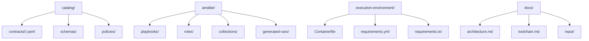

# Architecture

## Conceptual flow

```mermaid
flowchart LR
    A["Data producer or domain owner"] --> B["Data contract in catalog<br/>YAML + schema + metadata"]
    B --> C["Validation pipeline<br/>schema checks<br/>policy checks<br/>ownership checks"]
    C --> D["Approved contract artifact"]
    D --> E["Ansible development inputs<br/>vars, templates, inventory data"]
    E --> F["AAP automation content<br/>playbooks, roles, collections"]
    F --> G["AAP execution<br/>job templates, schedules, workflows"]
    G --> H["Operational evidence<br/>run results, compliance status, drift findings"]
    H --> I["Catalog status and governance review"]
```

## What the catalog should own

The catalog should be authoritative for:

- contract identity
- domain and service ownership
- dataset purpose
- schema and version
- interface locations
- data classification
- quality expectations
- operational dependencies
- required controls

It should not become a dumping ground for all runtime configuration. Only keep the metadata that should drive decisions, validation, or automation.

## How the catalog ties into Ansible

Recommended boundaries:

- Contract files define intent and required controls.
- Validation automation verifies structure and policy.
- Generation automation derives safe downstream inputs.
- Ansible content performs environment actions based on approved artifacts, not raw unvalidated edits.

That separation matters. It keeps human-authored contracts reviewable and keeps operational automation deterministic.

## Proposed repository layers

## Example contract-to-automation mappings

| Contract field | Why it matters | Possible automation use |
| --- | --- | --- |
| `owner` | accountability | approval routing, notification targets |
| `classification` | security handling | policy checks, environment restrictions |
| `quality.slo` | operational expectation | monitoring thresholds, validation rules |
| `interfaces` | integration points | inventory generation, job inputs |
| `schema` | compatibility | change validation, downstream impact checks |
| `controls.required` | mandatory safeguards | gate checks before promotion |

## First implementation path

The first useful implementation is usually:

1. contract definition
2. validation
3. generated vars or templates
4. Ansible content consuming those generated artifacts

That produces a demonstrable control loop without needing to solve the entire platform at once.
