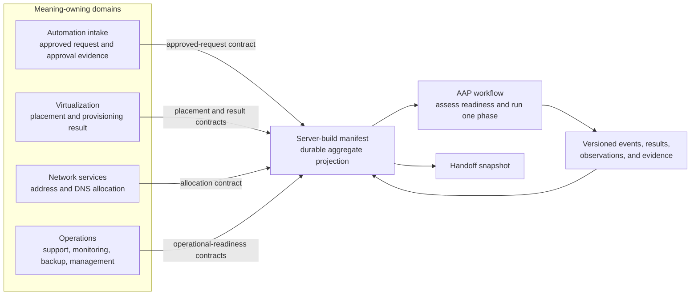

# Data contract catalog solution

## Purpose

This document defines a general, lightweight catalog pattern for automation
pipeline proofs of concept. It is intentionally independent of one
organization, catalog product, automation platform, or infrastructure vendor.

The organizing rule is:

> Organize by who owns the meaning; classify by how it is implemented.

The catalog makes integration data discoverable, reviewable, testable, and
traceable before a portal or enterprise policy platform is required. It does
not replace systems of record, workflow state, secrets management, or runtime
provider APIs.

## Problems the catalog addresses

- Integration fields are scattered across tickets, CSV files, inventories,
  playbooks, and team knowledge.
- Automation developers are forced to decide values whose meaning belongs to
  another business or platform owner.
- Provider-specific payloads become accidental enterprise interfaces.
- Windows and Linux implementations drift even when the lifecycle outcome is
  the same.
- A partially complete build has no durable record of approved intent,
  blockers, provenance, or handoff evidence.
- Changes to a producer or consumer are discovered only during a runtime job.

## Catalog model

| Element | Question it answers | Example |
| --- | --- | --- |
| Domain | Who owns the meaning? | network services |
| Product or capability | What durable outcome is offered? | address management |
| Contract | What stable boundary do producers and consumers agree on? | address-allocation request and result |
| Artifact | What instance conforms to that boundary? | one allocation result or build manifest revision |
| Mapping or profile | Who selects an approved value from owned policy? | OS profile to VMware template |
| Adapter | How is the contract implemented for one provider? | Infoblox adapter |
| Evidence | What proves an operation or observation occurred? | registration result or facts snapshot |

A technology name can be useful classification metadata without becoming the
top-level organizing principle. A domain contract should describe
provider-neutral meaning. An adapter can then map the contract to VMware,
Infoblox, F5 BIG-IP, Red Hat Satellite, Microsoft Configuration Manager, or a
mock service.

## Logical view



The manifest is useful because it assembles the state needed to coordinate one
build. It is not the authoritative owner of every field it carries. Each
projected field should retain its source, decision owner, contract reference,
and evidence where practical.

## Repository hierarchy

```text
catalog/
  catalog.yaml
  domains/
    <domain>/
      domain.yaml
      contracts/
        <interface>/contract.yaml
      products/
        <product>/
          product.yaml
          contracts/
            <interface>/contract.yaml
          mappings/
          adapters/
            <provider>/adapter.yaml
          examples/
```

The hierarchy allows a small domain to own contracts directly while a larger
domain can group them under products. Avoid creating a `shared` domain merely
to reduce duplication. A shared contract should appear only after multiple
domains agree on one semantic owner and a genuinely common meaning.

## Contract minimum

Each catalog contract should identify:

- a stable, globally unambiguous contract ID
- domain, owner, steward, version, lifecycle status, and classification
- purpose, scope, and explicit limitations
- producer and consumer responsibilities
- artifact or request/result kinds
- required inputs, outputs, evidence, and their semantic owners
- identity, replay, ordering, idempotency, and retention behavior where relevant
- failure codes and whether each failure is retryable
- references to mappings, schemas, adapters, and authoritative definitions
- representative valid, invalid, blocked, and replay examples

The current POC YAML is a lightweight catalog model, not a claim of full Open
Data Contract Standard conformance. ODCS remains useful as a reference for
identity, domain, ownership, version, status, schema, quality, support, and
authoritative-definition metadata.

## Contract ownership rules

1. One contract has one accountable meaning-owning domain.
2. Consumers reference a contract; they do not copy it into their own domain.
3. Provider payloads are adapter outputs, not automatically enterprise
   contracts.
4. A build manifest can project external data but must not silently redefine it.
5. A mapping is owned by the team authorized to make the mapped decision.
6. Stable IDs survive folder moves and display-name changes.
7. Breaking semantic or structural changes require a new major version or a
   new contract ID.
8. Examples are synthetic and must pass repository public-data checks.

## Windows, Linux, facts, and agents

Windows and Linux server profiles should declare required capabilities and
reference the relevant contracts. They should not absorb the complete schema
for every management agent.

Create a separate integration contract when a capability has one or more of
these characteristics:

- a different accountable owner or system of record
- independent registration, retry, upgrade, or decommission behavior
- its own API, identity, status, or evidence model
- use across more than one server product or operating system
- a handoff gate that must be proved independently

Keep a value in the OS or server profile when it is only a local package,
service, or configuration choice with no independent integration lifecycle.

For example, a Linux profile can require a
`linux-content-registration` capability. The Satellite activation-key,
content-view environment, registration result, and facts snapshot belong to
that capability's contracts. RHSM facts are observed evidence from a target
and should not become authoritative desired fields in the generic Linux server
contract. The equivalent Windows profile can require an endpoint-management
capability whose Microsoft Configuration Manager client registration, health,
and inventory evidence are separately modeled.

## Change and promotion flow

```text
propose -> validate structure -> validate examples -> test consumers
        -> review by meaning owner -> publish version -> promote adapter
```

For this repository, a pull request is the initial review and promotion
boundary. Mature implementations can add schema compatibility checks, signed
artifacts, catalog ingestion, policy gates, and controlled publication to
object storage or a registry.

## Relationship to Ansible and AAP

- Ansible roles consume validated artifacts and explicit contract versions.
- Roles implement one bounded behavior and retain Molecule tests.
- Provider roles or collections sit behind adapters.
- AAP job templates execute short, observable phases.
- AAP workflow templates coordinate gates, branches, approvals, and phase jobs.
- Durable manifests and evidence live outside the ephemeral job filesystem.
- Scheduled AAP work is appropriate for reconciliation, expiration, and
  stuck-build checks; request-driven work should normally launch from the
  approved event or API call.

The catalog describes what the interfaces mean. Ansible implements and tests
transformations and operations. AAP coordinates execution. Object storage
retains durable artifacts. None of these layers should silently take ownership
of another layer's semantics.

## POC maturity boundaries

The current catalog proves:

- domain-first discoverability
- stable references across domain, product, contract, mapping, and adapter
- an approved-request event boundary
- a Windows/Linux server-build lifecycle and manifest aggregate
- a provider-neutral address-allocation contract
- a simulated Infoblox implementation adapter
- Ansible and Molecule consumers that follow the catalog paths

The current catalog does not yet provide:

- formal JSON Schema validation for every artifact
- compatibility analysis across contract versions
- a searchable catalog portal
- contract publication or signatures
- runtime authorization or policy enforcement
- production integration credentials or endpoints
- automatic lineage capture

Those are maturity increments, not prerequisites for learning from the first
pipeline.

## Related material

- [Contract concept backlog](contract-concept-backlog.md)
- [Architecture](architecture.md)
- [Process views](process-views.md)
- [Object-storage artifacts](object-storage-artifacts.md)
- [Reality check](reality-check.md)
- [Reference resources](resources.md)
