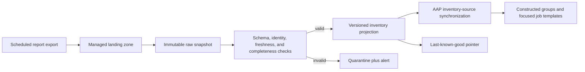
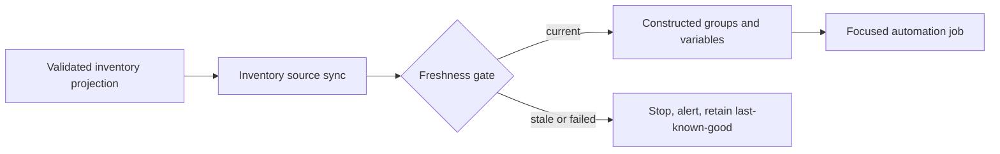
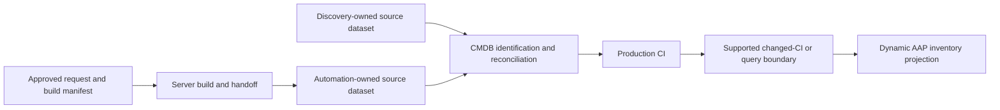

# Discovery-to-automation awareness

## Purpose

This is a reusable architecture discussion for environments where discovery
data reaches Ansible Automation Platform (AAP) through a reporting extract
rather than a supported CMDB query or update interface.

The useful lens is the **inventory data supply chain**: how long it takes a
real infrastructure change to become safe, visible, and targetable in
automation.

The design has three horizons:

1. make the constrained current path visible
2. improve ingestion without changing the CMDB access restriction
3. establish a governed CMDB integration as the long-term target

The first two horizons do not require direct query or update access to the
CMDB.

## Executive conclusion

A scheduled report can remain the permitted source while the processing path
is modernized. The achievable pattern is to land each report once, retain an
immutable raw snapshot, validate and normalize it into a versioned inventory
projection, and synchronize that projection through an AAP inventory source.

This can remove avoidable hours of file copying, parsing, and shadow-host
execution after the report arrives. It cannot make an upstream report arrive
sooner than its production schedule.

The ideal target is not an Ansible playbook writing arbitrary fields directly
into the CMDB production dataset. Build automation should publish the facts it
owns into a dedicated source or staging dataset through a supported
integration boundary. CMDB identification and reconciliation rules then merge
those facts with discovery according to source and attribute precedence.

## The five representations

The current problem is easier to reason about when five representations are
kept separate.

| Representation | Meaning | Typical owner |
| --- | --- | --- |
| Actual infrastructure | The server and its current runtime state | infrastructure and operating-system platforms |
| Discovered observation | What an agent, scanner, hypervisor, or other observer saw at a point in time | discovery platform |
| Reconciled CMDB record | The CI produced from one or more governed source datasets | configuration-management capability |
| Reporting extract | A scheduled, filtered representation of CMDB data | reporting or analytics capability |
| AAP inventory projection | The host, groups, connection metadata, and approved variables needed for automation targeting | automation platform |

An AAP inventory is a consumer-specific projection. It should not be treated as
the enterprise system of record, and a report-processing playbook should not
silently become one.

## Horizon 0: constrained current pattern

The representative path is:


The technology products are not individually the anti-pattern. The risk comes
from the combined supply chain:

- discovery, reconciliation, report generation, file transfer, parsing, and
  inventory publication each introduce a separate cadence boundary
- shared files become both transport and working state
- AAP records the outer `localhost` job while the persistent utility host owns
  the real processing, dependencies, files, and retry context
- a monolithic parse-and-publish job has a large failure domain
- freshness and rejection conditions are not visible to downstream jobs
- the final inventory is treated as current even when its source observation
  is old

In one representative environment this path has more than 24 hours of
discovery-to-AAP awareness latency, with hours spent in downstream inventory
processing. That is an environment observation, not a universal product
performance claim.

## Horizon 1: achievable pattern within report-only access

Keep the reporting extract as the permitted integration boundary, but replace
the file-processing chain behind it.



### Processing responsibilities

1. The reporting platform delivers a completed export to a managed landing
   zone. SFTP is one documented ReportCaster option; a controlled transfer can
   then place the artifact in an S3-compatible object store if required.
2. A small ingestion worker detects a new file or object. It is independent of
   server-configuration job templates.
3. The worker retains the original artifact and records source, report
   production time, receipt time, checksum, schema version, and ingestion
   identity.
4. Validation checks schema, required identity, duplicate records, record
   count, source age, and completeness before publication.
5. A valid report becomes a versioned, controller-consumable inventory
   projection. An invalid report is quarantined and does not replace the
   last-known-good projection.
6. An AAP inventory source synchronizes the projection on a schedule or before
   dependent jobs, using an intentional cache timeout.
7. Automation jobs consume the synchronized inventory. They do not download
   and parse the source report.

### Why this is achievable

- it respects the existing report-only access boundary
- it removes the persistent shadow host and shared-folder working state from
  the automation execution path
- it makes source age, processing time, rejection, and publication explicit
- it separates ingestion retries from server-automation retries
- it creates an immutable evidence trail for every inventory snapshot
- it supports a small non-production pilot without redesigning the CMDB

### What it cannot solve

- it cannot make discovery run more frequently
- it cannot make the CMDB reconcile sooner
- it cannot make the reporting platform publish sooner
- it cannot provide pre-discovery awareness of a newly built server

The first pilot should therefore claim a reduction in **post-report inventory
latency**, not real-time inventory.

## Inventory snapshot contract

The report adapter and the AAP inventory adapter should be separated by a
provider-neutral snapshot contract.

```yaml
api_version: automation.example/v1alpha1
kind: InventorySnapshot
metadata:
  snapshot_id: inventory-2026-07-18T140000Z
  source: enterprise-cmdb-report
  source_report_id: managed-server-inventory
  schema_version: "1.0.0"
  produced_at: "2026-07-18T13:45:00Z"
  received_at: "2026-07-18T13:47:12Z"
  published_at: "2026-07-18T13:48:03Z"
  checksum: sha256:example
status:
  record_count: 2400
  accepted_count: 2397
  rejected_count: 3
  freshness_seconds: 1083
  disposition: published_with_rejections
records:
  - source_identity: ci-example-001
    provider_identity: vm-example-001
    hostname: app-example-001
    observed_at: "2026-07-18T13:30:00Z"
    automation_eligible: true
    groups:
      - linux
      - production
    variables:
      connection_profile: linux-managed
```

The example values are synthetic. In production, variable publication must be
an allowlist. Secrets remain in AAP credentials, and business-sensitive CMDB
attributes should not be copied into inventory without a documented need.

### Required semantics

- `produced_at`, `received_at`, and `published_at` are different times
- `observed_at` belongs to each source observation when available
- a stable source identity is required; hostname alone is often insufficient
- duplicate delivery is idempotent by source, checksum, and report identity
- malformed or stale snapshots cannot silently replace the current projection
- the last-known-good policy and maximum permitted age are explicit
- exclusion from inventory is an explained decision, not an accidental parse
  failure

## AAP execution pattern

AAP should expose inventory synchronization as a controller resource.



Red Hat documents project-backed inventory sources, custom inventory scripts,
scheduled synchronization, `Update on launch`, and cache timeout controls.
Upstream Ansible recommends inventory plugins over scripts for new dynamic
inventory integrations and provides inventory caching for expensive sources.

The POC should start with the least complex supported projection that preserves
the boundary. A project-backed inventory artifact is acceptable for a small
fixture. A reusable production integration is more likely to become a custom
inventory plugin or inventory service with caching and explicit error
semantics.

`localhost` remains valid for a bounded API or ingestion task running inside a
versioned execution environment. It becomes an anti-pattern when it launches a
persistent host that owns the real scripts, mutable state, inventory, and
retry behavior.

## Horizon 2: ideal governed CMDB pattern

The ideal target adds automation as a governed CMDB data source without
displacing discovery.



BMC documents source-specific datasets, identification, reconciliation,
attribute precedence, and a production dataset produced by reconciliation. Its
guidance explicitly warns against updating the production dataset directly.

The target pattern is therefore:

1. A completed build or handoff emits an idempotent integration payload.
2. A supported CMDB integration service writes the payload to an
   automation-owned source or staging dataset.
3. Identification matches the record to the correct CI using governed
   identity rules.
4. Reconciliation applies source and attribute precedence.
5. Discovery later corroborates or corrects observed facts.
6. A supported changed-CI, query, or inventory-service boundary publishes a
   fresh AAP inventory projection.

### Example attribute authority

| Attribute or evidence | Preferred source |
| --- | --- |
| approved request ID and service owner | request/build automation |
| requested hostname and environment | request/build automation until reconciled |
| build completion and handoff time | build automation |
| VMware durable object identity | VMware result or observation |
| current hardware, software, and runtime facts | discovery |
| reconciled CI identity and approved relationships | CMDB reconciliation |
| AAP groups and connection profile | inventory projection policy |

Authority must be decided attribute by attribute. “Automation updates the
CMDB” should never imply that automation owns every discovered property.

### Value of the ideal pattern

- a handed-off server can become visible to automation before the next full
  discovery/report cycle
- approved intent and build evidence survive after the workflow completes
- discovery and build automation can disagree visibly instead of silently
  overwriting one another
- CI identity and duplicate handling are centralized
- AAP inventory freshness no longer depends on a human-oriented reporting
  chain
- decommissioning and lifecycle changes can use the same governed interface

## Failure and freshness rules

| Condition | Expected behavior |
| --- | --- |
| duplicate report delivery | acknowledge the existing ingestion; do not republish |
| incomplete file still being transferred | do not ingest until completion is proven |
| schema change | quarantine and alert; keep last-known-good |
| duplicate or unresolved host identity | reject affected records and surface counts |
| report older than the freshness objective | stop dependent automation or require an explicit exception |
| inventory sync failure | do not run a job that assumes fresh membership |
| CMDB reconciliation collision | preserve source payload and route for configuration-data ownership review |
| discovery has not yet observed a completed build | label as not-yet-observed, not automatically mismatched |

Fail-open versus fail-closed is use-case specific. Destructive, patching, or
security operations should generally require stricter freshness than a
read-only reporting job.

## Measures

Measure the supply chain at explicit boundaries:

- source observation age at report production
- report production-to-landing duration
- ingestion and validation duration
- current projection age
- AAP inventory-sync duration and result
- accepted, rejected, duplicate, and identity-collision counts
- percentage of jobs started with inventory inside the freshness objective
- elapsed time from completed handoff to AAP eligibility

The main outcome is **awareness latency**, not merely “the report job
completed.”

## Incremental proof plan

### Increment 1: constrained ingestion

- use synthetic IBI/WebFOCUS-style CSV fixtures
- land files in a local S3-compatible service
- retain raw, quarantined, validated, and current projections
- validate identity, schema, duplicates, and freshness
- publish a deterministic AAP inventory fixture
- prove replay, malformed input, partial transfer, stale input, and
  last-known-good behavior
- compare processing time and traceability with a representative shared-file
  path

### Increment 2: controller synchronization

- configure a non-production AAP inventory source
- synchronize on a short schedule and before a dependent workflow
- enforce a freshness gate
- derive Windows/Linux and lifecycle groups through owned mappings
- prove that server jobs do not parse the source report

### Increment 3: ideal integration design

- define the automation-owned CMDB source dataset
- document CI identification keys and duplicate handling
- assign attribute authority and reconciliation precedence
- define the supported write and changed-CI/query interfaces
- test with synthetic payloads before requesting production access

## Decision points

- Who owns the reporting extract's schema and delivery objective?
- What proves a report is complete and safe to ingest?
- Which identity is stable across UCMDB, Helix CMDB, VMware, and AAP?
- What is the maximum source age for each automation class?
- Which CMDB attributes can build automation authoritatively publish?
- Which team owns identification and reconciliation rules?
- What is the last-known-good and exception policy?
- Is SFTP the managed landing boundary, or can the report be transferred
  directly into the on-premises object service?

## Authoritative references

- [OpenText Universal Discovery and CMDB architecture](https://docs.microfocus.com/doc/UCMDB/24.4/Architecture)
- [OpenText Universal Discovery and CMDB glossary](https://docs.microfocus.com/doc/UCMDB/24.2/GlossaryCMS)
- [TIBCO WebFOCUS ReportCaster guide](https://docs.tibco.com/pub/wf-wf/9.3.6/doc/pdf/IBI_wf-wf_9.3.6_reportcaster_guide.pdf?id=6)
- [BMC Helix CMDB datasets](https://docs.bmc.com/xwiki/bin/view/Service-Management/IT-Service-Management/BMC-Helix-CMDB/ac254/Getting-started/Key-concepts/Datasets-to-partition-data/)
- [BMC Helix CMDB dataset best practices](https://docs.bmc.com/xwiki/bin/view/Service-Management/IT-Service-Management/BMC-Helix-CMDB/ac252/Administering/Managing-data-sources-and-datasets-in-BMC-Helix-CMDB/Best-practices-for-managing-datasets/)
- [BMC Helix CMDB reconciliation planning](https://docs.bmc.com/xwiki/bin/view/Service-Management/IT-Service-Management/BMC-Helix-CMDB/ac252/Planning/Planning-data-reconciliation/)
- [BMC Helix CMDB REST API overview](https://docs.bmc.com/xwiki/bin/view/Service-Management/IT-Service-Management/BMC-Helix-CMDB/ac251/Developing/Using-BMC-Helix-CMDB-functions-in-an-external-application-with-the-REST-API/Learning-about-the-REST-API/Overview-of-the-REST-API/)
- [Red Hat AAP 2.5 inventories](https://docs.redhat.com/en/documentation/red_hat_ansible_automation_platform/2.5/html/using_automation_execution/controller-inventories)
- [Red Hat automation controller best practices](https://docs.redhat.com/en/documentation/red_hat_ansible_automation_platform/2.5/html/using_automation_execution/assembly-controller-best-practices)
- [Red Hat AAP workflows](https://docs.redhat.com/en/documentation/red_hat_ansible_automation_platform/2.5/html/using_automation_execution/controller-workflows)
- [Ansible dynamic inventory](https://docs.ansible.com/projects/ansible/latest/inventory_guide/intro_dynamic_inventory.html)
- [Developing Ansible inventory plugins](https://docs.ansible.com/projects/ansible/latest/dev_guide/developing_inventory.html)
- [Ansible inventory caching](https://docs.ansible.com/projects/ansible/latest/plugins/cache.html)
