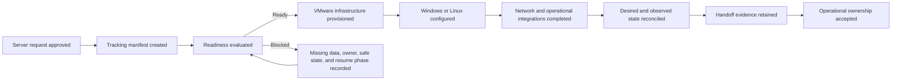
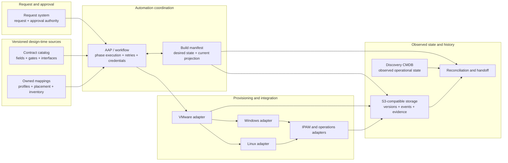
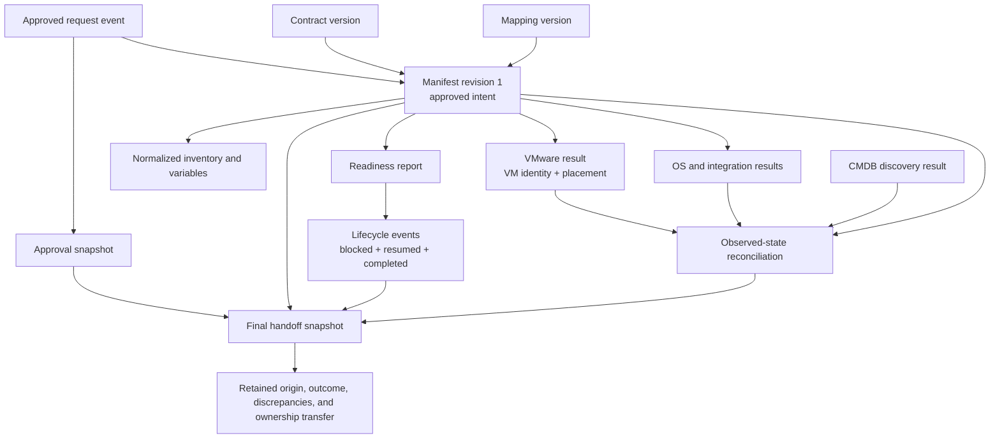
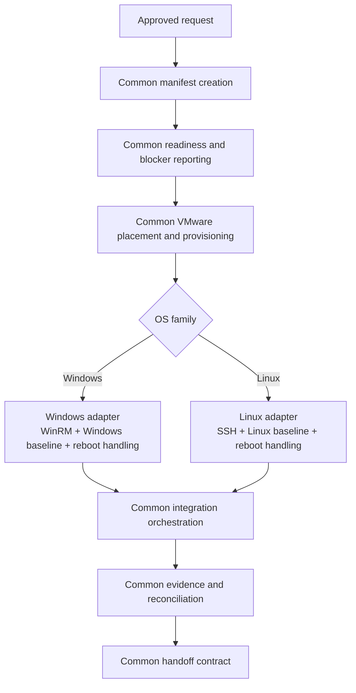
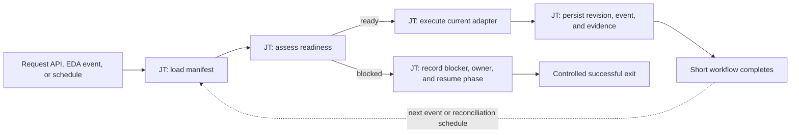

# Server-build process views

These views describe the same POC from different stakeholder perspectives. Each diagram answers a distinct question.

## 1. Executive view: from approval to accountable handoff

This view shows the outcome of the process without implementation detail.

The important change is that waiting becomes an explicit, owned state instead of an informal queue hidden across tickets and CSV files.

## 2. Responsibility view: which system owns which part

This view prevents the manifest, object store, workflow engine, and CMDB from becoming competing sources of truth.

## 3. Artifact-lineage view: how intent survives the build

This view explains why the manifest and object-storage layer add value when the CMDB is discovery-only.

The final snapshot is evidence of what was approved, what automation derived, what providers returned, and whether handoff succeeded.

## 4. Reuse view: one lifecycle, two operating-system adapters

This view shows where Windows and Linux should remain common and where divergence is legitimate.

The reusable interface is the common outcome of each phase, not identical task implementation inside each operating system.

## 5. Development view: how content moves toward AAP

```mermaid
flowchart LR
    A["Developer<br/>Windows workstation or Dev Spaces"] --> B["Git branch and pull request"]
    B --> C["Fast checks<br/>YAML + fixtures + Ansible lint"]
    C --> D["Behavior tests<br/>Podman execution environment"]
    D --> E["Versioned role or collection artifact"]
    E --> F["Published execution environment"]
    F --> G["Non-production AAP"]
    G --> H["Disposable providers and targets"]
    H --> I["Promotion evidence"]
    I --> J["Controlled production release"]
```

Local Podman, CI, and AAP should consume the same dependency and content definitions even when credentials and target access differ.

## 6. AAP workflow view: one short build phase

This is the logical controller-level shape for a single phase. Job templates
remain small and reusable. The workflow branches on readiness, persists a
durable artifact, and exits rather than waiting for a human input.

Workflow success, failure, and always paths coordinate the jobs. They do not
replace the manifest and lifecycle events as the portable record of state.
