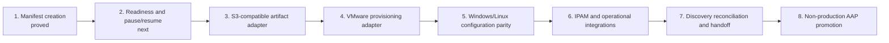

# POC roadmap

## Current position

The repository has proved the first executable slice:

- common Windows/Linux server-build contract
- synthetic approved-request events
- deterministic manifest creation
- owned mappings for VMware, OS, inventory, network, and operations inputs
- request-plus-approval idempotency
- incompatible platform rejection
- Linux execution-environment tests through Podman

The next milestone should make the retained manifest operational by evaluating readiness and updating lifecycle state.

## Maturity path

## Recommended next milestone: readiness and lifecycle updates

### Build

1. Add a common readiness role that reads the contract gates and a manifest.
2. Produce a report for every gate rather than only the first failure.
3. Include missing field, expected source, decision owner, current safe state, and resume phase.
4. Add a lifecycle-update role that creates the next manifest revision and append-only event.
5. Reject invalid phase transitions and stale revisions.
6. Demonstrate blocked-to-ready resume for both Windows and Linux.

### Test

- complete request reaches `base-build-ready`
- incomplete request produces deterministic blockers
- Windows and Linux use the same readiness implementation
- stale manifest revision is rejected
- duplicate transition event is idempotent
- corrected data advances only the intended phase
- prior desired and derived values remain unchanged

### Exit evidence

- manifest revision history
- blocked and resumed lifecycle events
- readiness reports for Windows and Linux
- successful Podman test run
- documented fields still lacking an authoritative source or owner

## Following milestones

| Milestone | What it proves | Exit condition |
| --- | --- | --- |
| S3-compatible adapter | Artifacts survive outside a mounted workspace | versioning, retry, concurrency, certificate, policy, and performance tests documented |
| VMware adapter | Placement and provider identity are deterministic | mock and non-production providers return the same adapter contract |
| Windows/Linux adapters | OS differences remain behind a common interface | both platforms produce equivalent phase outcomes and evidence |
| Integration adapters | Network and operational handoffs are resumable | partial failures retain durable state and retry safely |
| Reconciliation | Approved intent can be compared with observed state | VMware, guest, and available CMDB values are classified as match, mismatch, or not yet observed |
| AAP promotion | Development and runtime paths are aligned | the tested execution environment and content run in non-production AAP |

## Why this order

Readiness and lifecycle state come before real provisioning because they address the largest current failure: builds proceeding with ambiguous data and then waiting without ownership.

Object storage comes before wider provider integration because it gives retries and partial failures a durable evidence boundary.

VMware comes before deep OS configuration because both Windows and Linux depend on a stable provider identity and placement result.

Production integrations and broader governance come only after the common lifecycle is demonstrably useful.

## Decisions to collect from the organization

- Which approved-request event creates the manifest?
- Which fields are required to create, provision, configure, and hand off?
- What is the safe blocked state after each phase?
- Who owns each missing value and each mapping?
- Which object-storage capabilities are available on premises?
- Which VMware templates and placement policies are approved?
- Which desired fields must reconcile with CMDB discovery?
- What evidence is required for operational acceptance?
