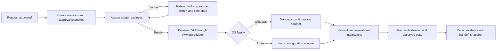

# Windows and Linux server-build POC

## Purpose

Use Windows and Linux virtual-machine builds to demonstrate one modern automation lifecycle from request approval through operational handoff.

The platforms should remain identical in approval, tracking, readiness, VMware provisioning, integration, evidence, and handoff behavior. They diverge only where the operating systems genuinely require different configuration or validation.

## Trigger and tracking artifact

The build manifest is created when a server request reaches an approved state.

Manifest creation must capture:

- request and approval references
- approval timestamp
- contract version
- source snapshot or immutable source reference
- initial desired values
- creation actor or automation event
- initial lifecycle phase

The manifest then travels with the build. Each phase adds status, derived values, external identifiers, blockers, and evidence. At successful handoff, a final snapshot preserves the approved intent and the result.

## Common lifecycle

1. **Approved** - the source request has passed its approval boundary.
2. **Manifest created** - an independently addressable tracking artifact exists.
3. **Base-build ready** - VMware placement, template, compute, and OS-profile inputs are valid.
4. **Infrastructure provisioned** - the VM exists and its VMware identifiers are retained.
5. **Network integration ready** - IPAM, DNS, and network values are available.
6. **OS configured** - the Windows or Linux platform adapter completed.
7. **Operational validation** - monitoring, backup, support ownership, and reconciliation evidence exist.
8. **Handoff complete** - the next owner accepted a verified result and a final snapshot was retained.

Any phase can transition to **blocked** with a reason, expected source, owner, retry information, and safe-state description. A blocked build resumes from retained state rather than reconstructing variables from tickets or CSV files.

## Common versus platform-specific behavior

| Capability | Common | Windows profile | Linux profile |
| --- | --- | --- | --- |
| Approval and manifest creation | yes | no divergence | no divergence |
| VMware clone and placement | yes | Windows template selector | Linux template selector |
| Compute, storage, and network facts | yes | no divergence | no divergence |
| Inventory derivation | common rules | WinRM connection profile | SSH connection profile |
| Base configuration | common role interface | Windows implementation | Linux implementation |
| Reboot/reconnect handling | common outcome | Windows-specific implementation | Linux-specific implementation |
| Monitoring, backup, ownership | yes | profile values may differ | profile values may differ |
| Evidence and handoff | yes | no divergence | no divergence |

## Desired and observed state

The manifest preserves approved intent before a configuration item can be discovered:

- **desired state** - approved and derived values in the manifest
- **VMware observed state** - VM identity, placement, power, hardware, and guest facts
- **CMDB observed state** - discovered operational record when discovery completes

The handoff gate compares relevant desired and observed values and retains the result. The POC does not require CMDB write access and does not claim that the manifest replaces the CMDB.

## Expected flow

## VMware boundary

The manifest should retain intended VMware placement and the adapter should return observed identifiers such as VM ID, instance UUID, vCenter, folder, cluster, datastore or storage policy, network attachment, and power state.

Credentials and endpoint configuration remain in AAP credential boundaries or a secret store. They do not belong in manifests or contracts.

## POC fixtures

The repository should cover:

- complete Windows request
- complete Linux request
- Windows request ready for VMware provisioning but waiting for network data
- Linux request waiting for operational ownership or integration data
- invalid OS/template pairing
- invalid VMware placement mapping
- no eligible IPAM subnet
- VMware or IPAM partial failure and retry
- observed-state mismatch before handoff

## Automation boundaries

- **manifest-creation role** - turns an approved request payload into the common envelope
- **readiness role** - evaluates gates and explains blockers
- **input-normalization role** - derives stable inventory, placement, and role inputs
- **VMware adapter role** - hides simulator or collection-specific provisioning behavior
- **Windows base role** - implements the common OS-role interface for Windows
- **Linux base role** - implements the same interface for Linux
- **IPAM adapter role** - hides mock or vendor-specific IPAM behavior
- **artifact-store role** - writes versioned artifacts through a local or S3-compatible provider
- **evidence role** - records results, reconciliation, and handoff status
- **thin playbook** - sequences lifecycle phases without owning business decisions

## Acceptance demonstration

A useful demonstration should show:

1. An approved request automatically creating a manifest with provenance.
2. Windows and Linux manifests passing through the same readiness evaluator.
3. A build stopping at the correct gate with actionable blockers.
4. A corrected manifest resuming without losing approved or derived values.
5. Deterministic VMware placement, inventory, and variables.
6. Mocked integration results retained in S3-compatible object storage.
7. Desired values compared with simulated VMware and CMDB discovery values.
8. A final handoff snapshot understandable without reading playbook code.

## What this does not claim

The POC does not choose the organization's final request product, CMDB design, approval model, object-storage vendor, or production OS implementation. It proves the artifact boundaries and automation-development practices needed to make those decisions with evidence.
